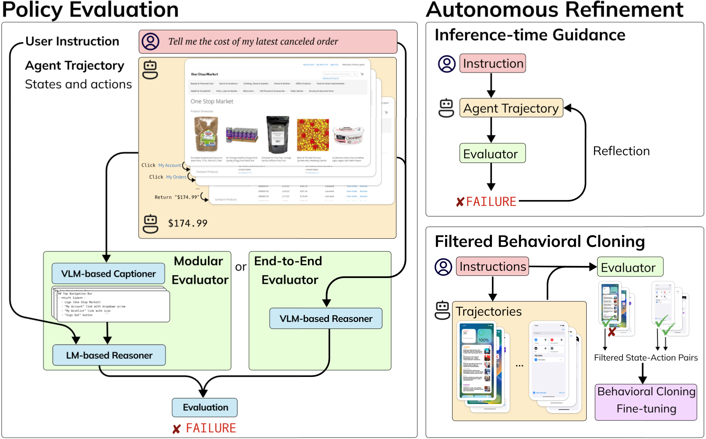

<div align="center">
  
  <h1 align="center">Autonomous Evaluation and Refinement of Digital Agents</h1>
</div>

### [Paper](https://arxiv.org/abs/2404.06474) | [Data and Models](https://huggingface.co/agent-eval-refine)

[Jiayi Pan](https://www.jiayipan.me/), [Yichi Zhang](https://sled.eecs.umich.edu/author/yichi-zhang/), [Nicholas Tomlin](https://people.eecs.berkeley.edu/~nicholas_tomlin/), [Yifei Zhou](https://yifeizhou02.github.io/), [Sergey Levine](https://people.eecs.berkeley.edu/~svlevine/), [Alane Suhr](https://www.alanesuhr.com/)

UC Berkeley, University of Michigan

<!-- 
## Contents:
1. [Getting Started](#start)
2. [Benchmark](#benchmarks)
3. [Evaluation](#evaluation)
4. [Training](#training)
5. [License](#license)
6. [Citation](#citation)
7. [Acknowledgement](#acknowledgement) -->

## Overview
<div align="center">
  
</div>

In this study, we design and use evaluation models to both evaluate and autonomously refine the performance of digital agents that browse the web or control mobile devices.

The evaluator and evaluation code is provided in `./agent_eval/` folder. You can use these models, either open weight or GPT-4V-based, to evaluate the performance of digital agents. Please refer to the [Evaluation](#Evaluation) section for more details.

The refinement and the ios/android emulator code is provided in `./exps/` folder. It provides examples to execute/improve a variety of agents on WebArena/Android/iOS.  Notably,
- Reflexion + GPT-4 agent which achieves 20.2% on WebArena and is current state-of-the-art. 
- Refined CogAgent model which achieves 75% relative improvement in success rate on iOS. 
- A Python binding for iOS and Android emulator to facilitate refinement and end-to-end evaluation of digital agents.

Please refer to the [Refinement](#Refinement) section for more details.

We release all models, agent trajectories and dataset on [Huggingface Hub](https://huggingface.co/Agent-Eval-Refine).

## Evaluation <a name="Evaluation"></a>
**Setup**

First install the `agent_eval` package
```
cd agent_eval
pip install -e .
```

If you want to do inference with the captioner model, you need to additionally revert the `transformers` package to an old version 

```
pip install transformers==4.32.0
```

**Evaluate Agent Trajectories**

You can evaluate agent trajectories by . You can download all agent trajectories used in the paper from [this link](https://huggingface.co/datasets/Agent-Eval-Refine/Agent-Trajectories).


Please visit the following files and change the configuration, setup the [OpenAI API Key](https://openai.com/blog/openai-api) (for GPT-4) / [Anyscale API key](https://www.anyscale.com/endpoints) (for Mixtral), and run the following command to evaluate the agent trajectories.
```python
cd ./agent_eval/agent_eval/scripts
# Select the right command according to the domain
python run_eval_web.py # for evaluating webarena agents
python run_eval_android.py # for evaluating android agents
python annotate_ios_dense.py # for providing dense annotations to iOS agents, later used as rewards in filtered-bc
```

**Inspect/Annotate Agent Trajectories**

We define a shared `UnifiedTrajectory` format to store agent trajectories, it's defined in `./agent_eval/agent_eval/domains/unified.py`. To transform raw agent trajectories to `UnifiedTrajectory`, you can use the corresponding notebooks under `./agent_eval/agent_eval/domains/` folder.

You can inspect or provide human annotations to the agent trajectories by running the following command:

```python
python -m agent_eval.eval.annotate_app --dataset <path-to-dataset> --log_name <log-name>
```

**Captioner**

The captioner VLM is used in the modular evaluator to provide dense descriptions of the screenshots, which is then feed into a LM to reason about the agent's behavior.
We provide [a demo](https://huggingface.co/spaces/Agent-Eval-Refine/Captioner), [its weight](https://huggingface.co/Agent-Eval-Refine/Captioner), and [training data](https://huggingface.co/datasets/Agent-Eval-Refine/GUI-Dense-Descriptions) on Huggingface Hub.

You can start the captioner server by running the following command:
```
python -m agent_eval.captioner.captioner_server --port <PORT_NUMBER>
````

[`./agent_eval/agent_eval/captioner`](./agent_eval/agent_eval/captioner) also include
- `annotate_screenshots.py`, code to annotate the screenshots with GPT-4V 
- `gen_captions.sh`, script to annotate a large number of screenshots with captions

## Refinement <a name="Refinement"></a>

You can download all agent trajectories used in the experiment from [this link](https://huggingface.co/datasets/Agent-Eval-Refine/Agent-Trajectories).

### Reflexion Agent on WebArena
- Please refer to [`exps/webarena_exp/README.md`](exps/webarena_exp/README.md) for more details on how to reproduce the results.

### Filtered-BC Refinement on iOS
- The tasks we used are listed in `exps/ios_exp/train_tasks.txt` and `exps/ios_exp/eval_tasks.txt`
- Please refer to [`exps/ios_exp/README.md`](exps/ios_exp/README.md) for more details on how to reproduce the results.

### Running Agents on Android
- The tasks we used are listed in `exps/android_exp/assets/instructions.txt`
- Please refer to [`exps/android_exp/README.md`](exps/android_exp/README.md) for more details on how to reproduce the results.


## Citation <a name="citation"></a>
Please consider citing our paper if you find this project helpful for your research:

```bibtex
TODO
```
